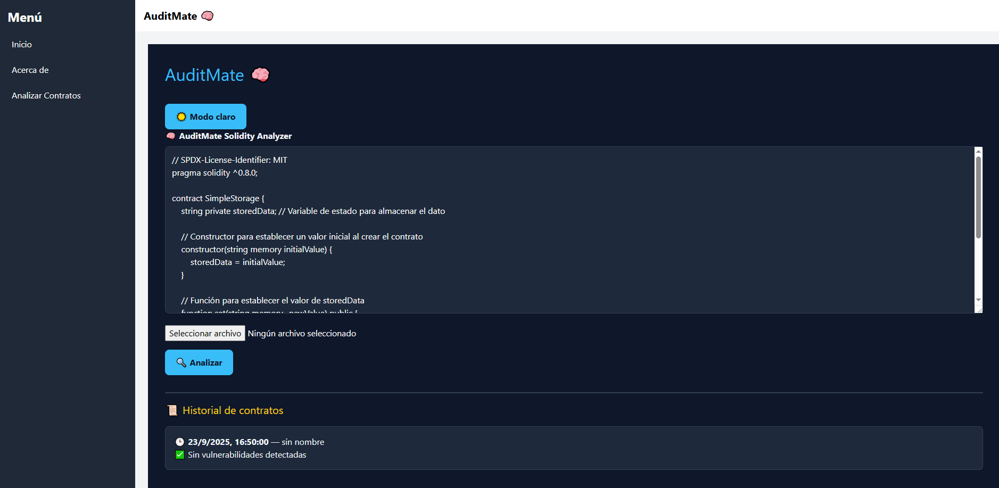
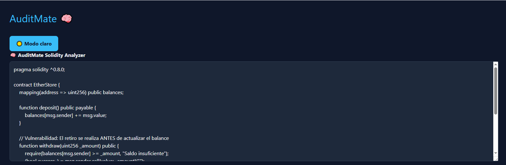

# AuditMate


AuditMate es una herramienta para la gestión y auditoría de proyectos.  
Su objetivo es simplificar el seguimiento de tareas, la generación de reportes y la colaboración entre equipos.

---

## ✨ Características

- **Gestión de auditorías:** Crea, edita y organiza auditorías fácilmente.
- **Reportes automáticos:** Genera informes detallados en PDF y Excel.
- **Colaboración:** Permite la asignación de tareas y comentarios entre usuarios.
- **Historial de cambios:** Registra todas las modificaciones para mayor transparencia.
- **Interfaz intuitiva:** Diseño moderno y fácil de usar.

---

## 🛠 Instalación

```bash
no information available
```

---

## 🚦 Uso

1. Inicia la aplicación.
2. Crea una nueva auditoría.
3. Asigna tareas y colaboradores.
4. Genera reportes desde el panel principal.



---

## 🧠 Respuestas con IA




---

## 🚀 Tecnologías utilizadas

-   
-    
-   
-    

---

## 🤝 Contribuir

¡Las contribuciones son bienvenidas!  
Por favor, abre un issue o envía un pull request.

[Contacto](https://fanzo.vercel.app/#contacto)

---

## 📄 Licencia

Este proyecto está bajo la licencia MIT.

---

## 📬 Contacto

[Formulario](https://fanzo.vercel.app/#contacto)  
[LinkedIn](https://www.linkedin.com/in/afanzo/)